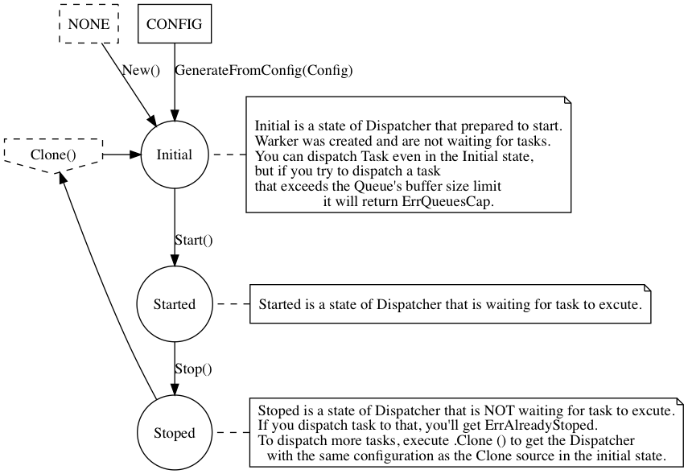

[](https://app.codacy.com/app/kamiazya/go-dispatcher?utm_source=github.com&utm_medium=referral&utm_content=kamiazya/go-dispatcher&utm_campaign=badger)
# Dispatcher [](https://godoc.org/github.com/kamiazya/go-dispatcher) [](https://travis-ci.org/kamiazya/go-dispatcher) [](https://codecov.io/github/kamiazya/go-dispatcher?branch=master) [](https://codeclimate.com/github/kamiazya/go-dispatcher/maintainability) [](https://codeclimate.com/github/kamiazya/go-dispatcher/test_coverage)

Package dispatcher implements a customizable Job Queue Dispatcher.

## Description

This package is a simple Job Queue of the Dispatcher-Worker model.

Implemented with API design that emphasizes Dispatcher's ease of creation and behavior customization.

## Features

- Simple Job-Queue
- Custom Dispatcher behavior

## Usage

Please install Package and include it in code.

```go
package main

import "github.com/kamiazya/go-dispatcher"

```

### New

You can get Dispatcher whth some Options like this.

```golang

// New Dispatcher
d, err := dispatcher.New(
    dispatcher.MaxWorker(2),
    dispatcher.MaxRetry(2),
)
if err != nil {
    // do something.
}

d.Start()

d.Dispatch(func() error {
    // do something.
    return nil
})

// wait for all tasks done
d.Wait()

```

### From Config

You can get Dispatcher whth Config like this.

```go

// default config
c := dispatcher.DafaultConfig()

// set value to config
c.MaxQueue = 10

// generate Dispatcher from config
d, _ := dispatcher.GenerateFromConfig(*c)

d.Start()

d.Dispatch(func() error {
    // do something.
    fmt.Println("this is the pettern of ")
    return nil
})

// Stop Dispatcher after all tasks done.
d.Stop(false)
```

## Lifecycle



## Installation

```bash
go get github.com/kamiazya/go-dispatcher
```
